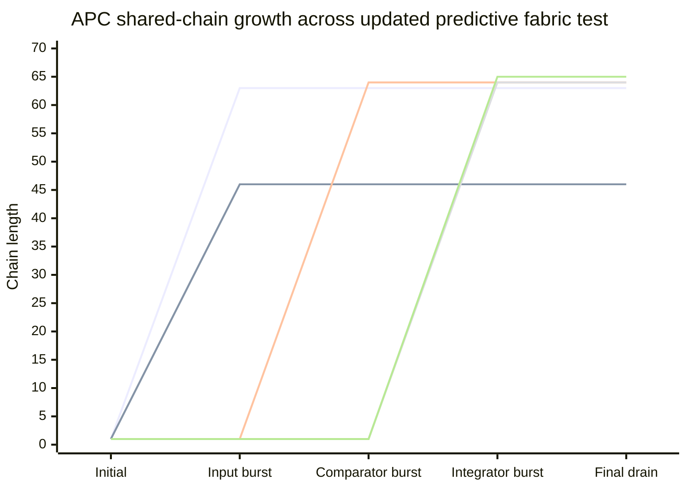

# AdaptivePackedCellContainer (APC)

AdaptivePackedCellContainer is an experimental C++ runtime substrate for **atomic, region-aware, causally tagged data cells**. It is designed around a simple but unusual idea: a cell should not only carry a value; it should also carry enough local metadata to describe its state, priority, signal class, datatype, and causal time.

The current implementation should be read as a research prototype and systems experiment, not as a production-ready container library. The uploaded build shows strong evidence that the publish/consume pipeline can move thousands of values without terminal failure, but it also exposes important accounting and efficiency issues that must be fixed before the structure can be treated as stable.

## Project status

**Status:** research prototype / experimental runtime.

**Current demonstrated strengths:**

- 64-bit atomic packed cell representation.
- 96-cell APC header/control plane.
- Regioned payload layout for feedforward, feedbackward, state, error, aux, control, weight, edge, free, undefined, and heterogeneous-memory classes.
- Bidirectional/predictive test topology using Sensor, Predictor, Comparator, Integrator, and Motor nodes.
- Shared-chain growth for logical nodes that exceed one physical segment.
- Causal clock fields and accepted/emitted clock metadata.
- Adaptive backoff and manager/QSBR scaffolding.

**Current demonstrated weaknesses:**

- Header/locality accounting can still disagree with exact payload scans.
- Shared-chain growth works but is currently very inefficient for small regions.
- The updated growth-oriented test reports final PASS, but it still produces long chains for a small burst.
- Some instrumentation counters are not fully consistent with visible chain growth.
- Some spelling and API naming issues remain; this matters because this code is complex and invariant-heavy.

## What APC is

APC is best understood as a **paged, segmented, heterogeneous event/state container**. It is not just a vector, queue, tensor, or graph node. It combines properties of all four:

- like a vector, it stores cells in contiguous memory;
- like a queue, it publishes and consumes values;
- like a graph node, it has logical identity and directional ports;
- like a neural runtime substrate, it separates feedforward, feedbackward, state, error, and auxiliary signal regions;
- like an event system, each cell carries clock and locality information.

The main architectural goal is to make each APC node a small self-describing computational region. A node can hold values, local state, prediction/error messages, graph edge descriptors, weights, auxiliary information, and future heterogeneous-memory references.

## What APC is not

APC is not yet a finished neural-network framework, tensor library, scheduler, or production allocator. It also should not be treated as a replacement for optimized matrix libraries. The intended future role is more realistic if APC becomes a **control plane and event substrate** while heavy numerical tensor work remains in proven libraries.

In practical terms, APC should eventually orchestrate:

- which cells are active;
- which region they belong to;
- whether the signal is feedforward, feedbackward, error, state, or auxiliary;
- whether the signal is stale or current;
- which node should receive the signal;
- which CPU/GPU/SIMD backend should process the numeric part.

The dense numerical part should remain in optimized tensor/matrix systems.

## Core design model

### 1. PackedCell64 model

The smallest unit is `PackedCell64_t`, a 64-bit atomic-compatible cell. The cell has two storage modes:

| Mode | Payload role | Control role |
|---|---:|---|
| `MODE_VALUE32` | 32-bit value | 16-bit clock + 16-bit metadata |
| `MODE_CLKVAL48` | 48-bit value/clock/counter payload | 16-bit metadata |

The metadata field acts as a compact control word. It encodes ideas such as:

- cell priority;
- node authority;
- cell locality/state;
- packed mode;
- APC region class;
- relation/offset mode;
- datatype.

This means a cell can be interpreted not merely as `float` or `uint32_t`, but as a **typed, staged, prioritized, region-aware event**.

### 2. APC header model

Every APC segment reserves 96 metacells before payload. The payload begins at index `96`.

The header contains identity, runtime, graph, layout, occupancy, and lifecycle information. Important fields include:

- magic ID and EOF header marker;
- manager and segment control flags;
- branch/logical/shared IDs;
- previous/next shared-chain IDs;
- branch depth and max depth;
- split threshold;
- region size/count;
- ready-bit mask;
- producer/consumer cursors;
- active thread count;
- CAS failure counter;
- graph ports;
- last accepted/emitted feedforward and feedbackward clocks;
- node compute kind;
- per-region layout bounds/version cells;
- per-region occupancy cells;
- central combined occupancy cell.

This is why APC should be understood as a **self-describing node segment**, not a plain container.

### 3. Region model

The payload is divided into semantic regions. The current source defines classes including:

| Region class | Intended meaning |
|---|---|
| `FEEDFORWARD_MESSAGE` | Bottom-up/evidence signal |
| `FEEDBACKWARD_MESSAGE` | Top-down/prediction/context signal |
| `LATERAL_MESAGE` | Peer-to-peer signal |
| `STATE_SLOT` | Local state or hidden state |
| `ERROR_SLOT` | Prediction error/residual/surprise |
| `EDGE_DESCRIPTOR` | Graph edge/routing information |
| `WEIGHT_SLOT` | Local or referenced parameters |
| `CONTROL_SLOT` | Header/control metadata |
| `AUX_SLOT` | Auxiliary/neuromodulatory/control values |
| `HETEROGENOUS_MEMORY_MAYBE_PAIRED_POINTER_OR_RAW_APC_SEGMENT` | Future external-memory bridge |
| `SLOT_TABLE_DESCRIPTOR` | Local pointer-pair storage |
| `PAIRED_POINTER_DISTANCE_MEMORY` | Remote pointer-pair storage |
| `FREE_SLOT` | Free payload capacity |
| `UNDEFINED` | Region for unclassified/emergent cells |
| `NANNULL` | Invalid/null/sentinel region |

This region model is the part that makes APC naturally suitable for bidirectional or predictive computation: feedforward, feedbackward, state, and error are first-class storage lanes rather than comments in a higher-level algorithm.

### 4. Timer and causal-clock model

APC uses two clock ideas:

- a 48-bit timer/clock cell for segment-level time;
- a compressed 16-bit clock inside value cells.

The 16-bit clock is useful as a compact local recency marker. It should be described carefully as a **local compressed causal/temporal stamp**, not as a complete proof of global ordering. It can approximate local freshness and help reject stale feedforward/feedbackward signals, but it is not by itself a full global logical-clock protocol.

The design intent is strong: each publish, consume, cursor move, and readiness decision should eventually be explainable using:

1. packed-cell priority;
2. packed-cell causality/clock;
3. region class;
4. node authority.

That principle is the right north star for this architecture.

### 5. SegmentIO model

`SegmentIODefinition` is the control surface for reading/writing APC metadata, layout bounds, occupancy counters, ready bits, clocks, ports, and region summaries.

It is responsible for:

- reading/writing metacells;
- initializing logical node identity;
- initializing node semantics;
- setting default segmented layout;
- reading and validating layout bounds/version fields;
- mutating layout under a mutation-in-flight flag;
- updating central and regional occupancy cells;
- reading published/claimed/faulty counters;
- setting/clearing ready bits;
- interpreting region pressure.

This component is the bridge between raw packed cells and the higher-level APC node model.

### 6. Occupancy model

The occupancy model has three layers:

| Layer | Purpose |
|---|---|
| Exact payload scan | Ground-truth debug view of actual payload cell localities |
| Regional occupancy cells | Fast summary per semantic region |
| Central combined occupancy cell | Node-level summary of published/claimed/faulty counts |

The intended invariant is:

```text
central summary ~= sum of relevant regional summaries ~= exact scan of payload/control scope
```

However, the current output shows that this invariant is not always cleanly represented. In the simple run, exact payload scans report `OK`, but header locality reports `BAD` because the header/locality summary includes control/metacell accounting in a way that does not match the exact payload-only scan.

This is not fatal to the idea, but it is a correctness-warning for the current implementation. The project should clearly separate:

- control/metacell occupancy;
- payload occupancy;
- region occupancy;
- whole-segment occupancy;
- whole-chain occupancy.

Until those scopes are separated, an invariant may look bad for the wrong reason or look good only after the payload drains.

### 7. Adaptive backoff model

The adaptive backoff system exists to avoid wasting CPU cycles during contention. When CAS loops fail, or when workers find no useful work, the runtime can spin, yield, park, or sleep depending on estimated pressure and priority.

This matters because APC is not a simple single-thread vector. It is intended for concurrent publish/consume behavior, background management, shared-chain growth, and eventual heterogeneous scheduling.

### 8. Manager and QSBR model

`PackedCellContainerManager` provides background management ideas:

- thread registration;
- epoch tracking;
- waiting/waking;
- work stack handling;
- cleanup stack handling;
- registry compaction;
- adaptive manager backoff.

The QSBR model is important because shared-chain growth and cleanup need safe reclamation. The current design has the right direction, but the README should honestly state that this must be heavily stress-tested before the structure can be called memory-safe under all concurrent workloads.

## Neural/predictive interpretation

The current demo models a small predictive neural fabric:

```text
Sensor.FF  ───────┐
                  │
                  v
              Comparator ── ERROR ──> Integrator ── STATE/MOTOR ──> Motor.FF
                  ^                                      │
                  │                                      v
Predictor.FB ─────┘                              Predictor.FB feedback
```

Interpretation:

- Sensor produces feedforward evidence.
- Predictor produces feedbackward prediction.
- Comparator compares evidence and prediction.
- Comparator emits error/state-like signals.
- Integrator combines state and error.
- Motor receives final feedforward output.
- Predictor receives feedback for later prediction updates.

This is a good conceptual fit for APC because feedforward, feedbackward, state, and error are stored as different region classes instead of being mixed in one flat queue.

## Current output summary

### Simple 25,600-item run

The simple run completed the full dataflow with no terminal failures:

| Metric | Value |
|---|---:|
| Runtime | 4,706,711 µs |
| Sensor FF produced | 25,600 |
| Predictor FB produced | 25,600 |
| FF consumed | 25,600 |
| FB consumed | 25,600 |
| State integrated | 25,600 |
| Error computed | 25,600 |
| State consumed | 25,600 |
| Error consumed | 25,600 |
| Forward emitted | 25,600 |
| Feedback emitted | 25,600 |
| Final collected | 25,600 |
| Grow FF | 136 |
| Grow FB | 38 |
| Grow STATE | 87 |
| Grow ERROR | 97 |
| Retry | 496 |
| Terminal fail | 0 |
| Older FF observed | 16,382 |
| Older FB observed | 18,205 |

This proves the high-level pipeline can complete, but the node summaries show a critical accounting issue: header locality reports `invariant=BAD` while exact payload locality reports `invariant=OK`. That means the current implementation should not yet be considered fully authoritative for occupancy accounting.

### Updated growth-oriented 320-burst run

The updated test is cleaner as a structural demonstration. It begins with five one-segment nodes, runs burst publication and draining through five phases, and finishes with all final invariants passing.

| Final metric | Value |
|---|---:|
| Runtime | 1,565,413 µs |
| Burst size | 320 |
| Node capacity | 256 |
| Sensor chain length | 63 |
| Predictor chain length | 46 |
| Comparator chain length | 64 |
| Integrator chain length | 64 |
| Motor chain length | 65 |
| Older cells observed | 1,373 |
| Motor outputs | 320 |
| Feedback outputs | 320 |
| Final overall invariant | PASS |

The result is mixed:

- correctness at the end is good;
- throughput of the test is acceptable for a prototype;
- chain growth is very high for only 320 values;
- the growth counter values printed as zero despite visible chain growth, so the instrumentation path is incomplete or not connected to this test path.

## Chain-growth line graph



The graph shows that the shared-chain mechanism works, but it also shows the largest present weakness: APC currently grows many physical segments for a small logical burst. That points to region sizing, probe budgeting, split thresholds, and local packing policy as the next optimization targets.

## Invariants to preserve

A correct APC build should preserve these invariants:

1. The first 96 cells are metacells; payload begins at index 96.
2. `MAGIC_ID` and `EOF_APC_HEADER` must be valid after initialization.
3. `TOTAL_CAPACITY_OF_THIS_SEGEMENT` must match the allocated segment size.
4. All region bounds must stay inside `[METACELL_COUNT, total_capacity]`.
5. Region bounds must be ordered and non-overlapping.
6. All layout bounds should share the same global layout version unless a layout mutation is in flight.
7. `PAGED_NODE_READY_BIT` should agree with whether tracked regions have published payload cells.
8. Exact payload scan and regional occupancy summaries must agree for the same scope.
9. Central occupancy must clearly define its scope: control-only, payload-only, segment-wide, or chain-wide.
10. Published → claimed → idle/faulty transitions must not lose or double-count cells.
11. Shared chains must not form self-loops or broken previous/next links.
12. Consuming an older clocked cell should be observable and counted, not silently treated as normal progress.
13. `FreeAll()` and manager cleanup must not reclaim a segment while another registered thread can still observe it.

## Known limitations and bugs

### 1. Occupancy-scope confusion

The current simple output shows header locality sums such as `sum=256 invariant=BAD`, while exact payload scans show `sum=160 invariant=OK`. This means the debug logic is mixing or comparing different scopes: full segment/control accounting versus payload-only accounting.

**Recommended fix direction:** define separate names and invariant checks for:

- `control_occupancy`;
- `payload_occupancy`;
- `region_occupancy`;
- `segment_occupancy`;
- `chain_occupancy`.

Never compare counters from different scopes as if they were the same invariant.

### 2. Chain growth is too aggressive

In the updated run, 320 burst values produce chains of 46 to 65 segments. This indicates that the current local insertion/probing/extension policy is not packing enough payload cells before growing.

**Recommended fix direction:** improve region-local indexing, increase useful probe budget, add free-slot borrowing logic, and avoid growing a child segment until local capacity and adjacent expandable region space are truly exhausted.

### 3. Growth counters do not match visible growth

The updated output reports `grow_sensor=0`, `grow_predictor=0`, and so on, even though chain lengths clearly increase. This likely means the counter passed into the test is not connected to the actual path that performs shared-chain allocation, or that the counter is reset/not incremented for the current growth path.

### 4. Linear/probing search remains a scaling risk

The code contains region arrays/bitmaps and cursor logic, but the publish/consume model still relies heavily on probing and scanning. That can be acceptable for early validation, but not for a high-performance neural runtime.

**Recommended fix direction:** introduce authoritative region indexes:

- one bitmap per region for published cells;
- one bitmap per region for claimed cells if needed;
- optional clock buckets for stale/young cells;
- per-region head/tail cursors;
- generation/version counters to validate indexes after layout mutation.

### 5. Layout mutation needs stronger transactional semantics

The current design has a layout mutation flag and global version. That is the right direction. The next step is to make layout mutation transactional:

1. claim mutation flag;
2. validate old version;
3. build candidate layout;
4. publish all new bounds under one new version;
5. update global version;
6. rebuild or validate indexes;
7. release mutation flag.

If any stage fails, the old layout must remain authoritative.

### 6. Pointer and heterogeneous-memory semantics are not finished

The source includes paired-pointer and heterogeneous-memory classes, but this part should be treated as future infrastructure unless tests prove acquisition, release, ownership, and reclamation are safe under concurrency.

### 7. Naming and spelling issues reduce maintainability

Examples include names such as `SEGEMENT`, `THRASHOLD`, `Cursore`, `LATERAL_MESAGE`, `HETEROGENOUS`, and `PREDECTIVE`. These do not change runtime behavior, but they make a complex architecture harder to audit.

## Why APC is not garbage

APC is not garbage because it has a real systems thesis:

> A memory cell in a neural/event runtime should carry value, state, datatype, signal direction, priority, and local time in one atomic unit.

That idea is coherent. It directly addresses problems that plain tensors do not address well:

- asynchronous online computation;
- local state and memory;
- signal direction;
- stale-message detection;
- heterogeneous signal classes;
- predictive/bidirectional dataflow;
- lock-free publication and consumption;
- future CPU/GPU orchestration.

The code is not merely redundant with `std::vector`, `std::queue`, or a tensor. Those structures do not make each slot self-describing in the way APC attempts to do.

## Why APC is not finished

APC is also not yet a proven runtime. The current implementation still has serious risks:

- occupancy counters need a stricter model;
- shared-chain growth needs better packing efficiency;
- manager/QSBR behavior needs stress testing;
- layout mutation must become transactional;
- scanning/probing must be replaced or assisted by indexes;
- heterogeneous-memory support needs tests;
- published benchmarks must distinguish control overhead from useful numeric work.

The correct engineering conclusion is:

> APC is a novel and promising prototype, but it is not production-stable yet.

## Developer bias / design philosophy

The architecture is strongly biased toward **self-aware cells**. In this context, “self-aware” means every cell knows enough about its own role to be interpreted without relying entirely on external container context.

That bias produces the following design choices:

- metadata is stored inside the cell;
- direction is encoded as a region class;
- priority is encoded inside the cell;
- local time is encoded inside the cell;
- payload and control live in one unified packed-cell memory model;
- nodes are designed as graph-like entities, not plain arrays;
- predictive/bidirectional computation is favored over one-way feedforward computation.

This bias is valuable for neuromorphic and event-driven research. It is also expensive: the design pays overhead in metadata, CAS loops, layout complexity, and debugging difficulty.

## How to use the current system conceptually

A typical APC test or application has this lifecycle:

1. Create a `PackedCellContainerManager`.
2. Configure `ContainerConf` with capacity, region size, branching, split threshold, max depth, producer block size, and node group size.
3. Create one or more `APCSegmentsCausalCordinator` nodes.
4. Initialize each node with a compute kind such as generator, bidirectional predictive, or generic vector.
5. Publish cells into semantic regions such as feedforward, feedbackward, state, or error.
6. Consume cells from regions using region-aware cursors.
7. Perform application-level computation on extracted values.
8. Publish the resulting cells into downstream regions/nodes.
9. Inspect exact payload scans, region pressure, ready bits, chain length, clocks, and final invariant summaries.
10. Free all nodes and stop the manager.

For beginners, the important idea is: **do not treat APC as a normal array**. Treat it as a node with control header, payload regions, clocks, occupancy summaries, and shared-chain growth.

## Future ML / neuromorphic direction

The most realistic future for APC is not to replace PyTorch, oneDNN, oneMKL, or other optimized tensor systems. The better path is to let APC become the **mutable control/event substrate** around optimized numeric kernels.

A future APC neural model could look like this:

- APC cells hold local event state, priority, region class, and clock.
- APC regions hold feedforward, feedbackward, state, error, and auxiliary signals.
- APC node chains represent logical neural modules or microcircuits.
- Dense parameter tensors remain in optimized tensor libraries.
- CPU/ARM/x86 SIMD controls headers, ready bits, clocks, routing, and compact indexes.
- GPU/XPU kernels operate on extracted float32/bfloat16 value batches and masks.
- Results are scattered back into APC cells with updated value, clock, locality, and metadata.

This is the cleanest way to “renovate the wheel” without rebuilding the already-proven matrix/tensor wheel.

## Minimal glossary

| Term | Meaning |
|---|---|
| APC | AdaptivePackedCellContainer |
| PackedCell | 64-bit value/control cell |
| Metacell | Header/control cell inside the first 96 cells |
| Payload | Data area after the metacells |
| Region | Semantic payload lane such as FF, FB, STATE, ERROR |
| FF | Feedforward message/evidence |
| FB | Feedbackward message/prediction/context |
| Locality | Cell state: idle, published, claimed, faulty |
| Clock16 | Compact in-cell clock/freshness stamp |
| Clock48 | Larger segment/timer clock field |
| Ready bit | Header bitmask showing which regions may contain work |
| Shared chain | Linked physical segments representing one logical node |
| QSBR | Quiescent-state-based reclamation strategy |

## Honest conclusion

AdaptivePackedCellContainer is a serious and original systems experiment. Its strongest idea is the packed cell: a 64-bit atomic datum that combines value, local clock, state, priority, datatype, authority, and signal class. That is a meaningful foundation for asynchronous, predictive, bidirectional, heterogeneous neural computation.

The current implementation is not yet clean enough to claim production correctness. The biggest immediate issues are occupancy accounting, growth efficiency, instrumentation consistency, indexing, and transactional layout mutation.

> APC is a novel research prototype with a coherent architecture, real test progress, and clear correctness/efficiency problems that must be fixed next.
