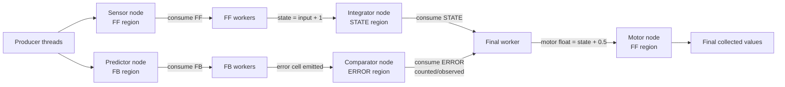
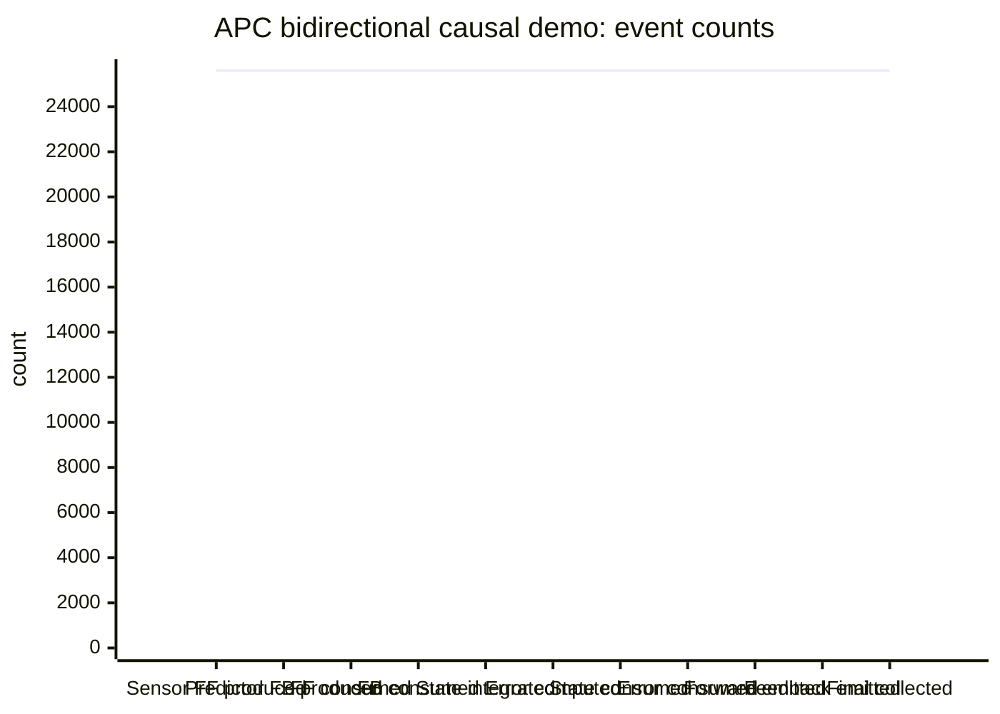
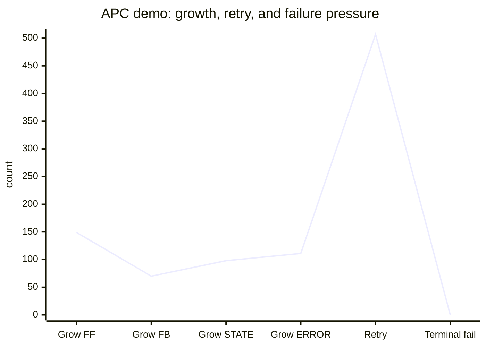

# AdaptivePackedCellContainer (APC)

AdaptivePackedCellContainer is an experimental C++ data-structure/runtime for **64-bit atomic packed cells**, causal message passing, segmented node memory, and multidirectional graph-style computation.

The project asks one central design question:

> Can a C++ data structure behave like a simulated-biological, heterogeneous, multidirectional, neuromorphic memory node: a structure that can hold values, carry compute-relevant metadata, remember its observer/state at a moment in time, and still run on ordinary silicon that supports C++ and 64-bit atomics?

The current answer is: **partly yes as a working prototype, but not yet as a finished production system**. The current demo proves that APC can move feedforward, feedback, state, error, and final values through an asynchronous graph. The current tests also expose real accounting and region-isolation bugs that must be fixed before the system should be treated as authoritative infrastructure.

---

## Project status

APC is currently a **research prototype**.

It is already capable of:

- packing a value, clock, locality, region class, priority, data type, and authority into one 64-bit cell;
- initializing an APC node with a 96-cell metadata header and a segmented payload region;
- publishing and consuming cells by semantic region;
- tracking local and per-region occupancy;
- rebuilding ready masks from exact scans;
- dynamically growing shared segments when a region is under pressure;
- running a bidirectional causal demo with no terminal failure in the pasted output.

It is not yet:

- a production lock-free container;
- a complete neural-network framework;
- a replacement for PyTorch, oneDNN, TensorFlow, or an LLM runtime;
- a proven neuromorphic learning algorithm;
- fully correct under all multi-region/shared-chain accounting cases.

---

## Core idea

A normal container stores values. APC stores **self-describing atomic events**.

Each cell is a `uint64_t`-sized atomic word. In the common `MODE_VALUE32` mode, the cell is conceptually split as:

```text
+------------------+------------------+------------------+
| meta16           | clock16          | value32          |
+------------------+------------------+------------------+
| type/state/route | local time stamp | payload value    |
+------------------+------------------+------------------+
```

The `value32` field can hold a `uint32_t`, `int32_t`, `float`, or small supported data type. The `clock16` field carries a local down-shifted clock stamp. The `meta16` field carries compact metadata: mode, priority, locality, region class, relative-offset mode, data type, and node authority.

In `MODE_CLKVAL48`, the lower 48 bits are used as a larger clock/value lane, still controlled by `meta16`.

The important design principle is:

> A cell should not be only a number. It should also carry enough information to say what kind of signal it is, where it belongs, how fresh it is, and how urgently it should be handled.

---

## Repository model

The current combined header/demo file contains these major pieces:

| Component | Purpose |
|---|---|
| `PackedCell64_t` | Encodes, decodes, inspects, and mutates one 64-bit packed cell. |
| `Timer48` | Provides a 48-bit-ish monotonic timing source. |
| `MasterClockConf` | Converts timer ticks into `clock16`, refreshes packed-cell clocks, and composes timestamped cells. |
| `AtomicAdaptiveBackoff` | Chooses spin/yield/sleep/park behavior during contention. |
| `SegmentIODefinition` | Owns most APC node metadata operations, layout operations, occupancy operations, and region helpers. |
| `AdaptivePackedCellContainer` | Main segmented container/node abstraction. |
| `PackedCellContainerManager` | Manager for thread registration, QSBR-style epoch tracking, adaptive backoff, and shared branch support. |
| `APCSegmentsCausalCordinator` | Thin causal graph wrapper over APC that tracks accepted/emitted clocks and offers causal publish/consume operations. |
| `main.cpp` demo | Builds a small Sensor → Integrator → Motor and Predictor → Comparator graph and prints runtime counters. |
| `TOTALAPCTEST` style test main | Runs focused invariant tests for packed cells, manager/QSBR, layout, occupancy, ready mask repair, growth, concurrency, and graph flow. |

---

## Memory layout

Each APC branch has a fixed metadata header followed by a payload region.

```text
index 0                                     index 95       index 96
+------------------------------------------+--------------+------------------+
| APC metadata / control header            | EOF header   | payload cells... |
+------------------------------------------+--------------+------------------+
```

The current header uses `METACELL_COUNT = 96`. The payload begins at index `96`.

Important header cells include:

| Header area | Examples |
|---|---|
| identity | magic id, branch id, logical id, shared id, previous/next shared id |
| runtime control | branch depth, max depth, branch priority, active threads, split threshold |
| capacity/layout | total capacity, region size, region count, producer/consumer cursors |
| clocking | local clock48, last accepted FF/FB clock16, last emitted FF/FB clock16 |
| graph ports | FF input/output target, FB input/output target, lateral targets |
| layout versions | FF, FB, lateral, state, error, edge, weight, aux, free, undefined |
| occupancy | central 3x16 occupancy cell and per-region occupancy cells |
| status | ready-bit mask, currently-owned flag, CAS failure count, EOF marker |

The payload is divided into semantic regions. In the current demo, the important regions are:

| Region | Meaning |
|---|---|
| `FEEDFORWARD_MESSAGE` / `FF` | bottom-up message/evidence stream |
| `FEEDBACKWARD_MESSAGE` / `FB` | top-down prediction/control stream |
| `STATE_SLOT` | local state or integrated values |
| `ERROR_SLOT` | error, residual, surprise, or feedback-derived computation |
| `AUX_SLOT` | auxiliary/control data |
| `FREE_SLOT` | available payload space |
| `UNDEFINED` | fallback/unknown region for future repair or migration logic |

---

## PackedCell model

A packed cell has four major conceptual planes:

1. **Value plane**  
   The payload itself: `uint32_t`, `float`, signed integer, char-like value, or a 48-bit clock/value in `MODE_CLKVAL48`.

2. **Time plane**  
   The local `clock16` stamp or a larger 48-bit timer field. This is not a global truth clock. It is a compact local ordering hint used for causal admission and emission tracking.

3. **State plane**  
   The locality state:
   - `ST_IDLE`
   - `ST_PUBLISHED`
   - `ST_CLAIMED`
   - `ST_EXCEPTION_BIT_FAULTY`

4. **Semantic/control plane**  
   The cell says what it means:
   - priority: idle, important, urgent, handle-now, structural dependency, time dependency, error dependency;
   - page/region class: FF, FB, state, error, aux, weight, edge, free, undefined;
   - data type: unsigned, signed, float, char;
   - node authority: idle/free, causal segment, neuromorphic paged graph, bidirectional neuromorphic system.

This is the main novelty of APC: the smallest unit of storage is also a small routing/control packet.

---

## Timer and clock model

`Timer48` and `MasterClockConf` provide the timing layer.

The current clocking model works like this:

1. A 48-bit timer value is read from `Timer48`.
2. `MasterClockConf` down-shifts the timer into a compact `clock16`.
3. New cells are composed with the current `clock16`.
4. APC nodes keep metadata for last accepted and last emitted FF/FB clocks.
5. `APCSegmentsCausalCordinator` uses these clocks to reject older cells when the clock comparison says they are not newer.

This is a local causal-clock approximation, not a perfect global ordering mechanism. The `clock16` field can wrap, so clock comparison must always be treated as local and bounded.

---

## Backoff model

`AtomicAdaptiveBackoff` is used when a publish, consume, metadata update, or contention-heavy loop cannot progress immediately.

The backoff layer estimates whether to:

- spin immediately;
- spin for a short duration;
- yield/sleep/park;
- wait/block depending on configuration and observed activity.

The intent is to avoid wasting CPU during long contention while still reacting quickly when a cell is likely to become available soon.

This matters because APC uses many CAS-style transitions. Without backoff, a failing thread can burn CPU while repeatedly scanning or trying to claim the same kind of cell.

---

## SegmentIO model

`SegmentIODefinition` is the main low-level API for a branch/node.

It handles:

- reading and updating metadata cells;
- writing and reading the local clock;
- initializing node identity and node semantics;
- initializing the default segmented layout;
- reading region bounds and layout versions;
- setting layout bounds while a layout-mutation flag is held;
- extending a region by borrowing space from a neighbor or free region;
- reading central and per-region occupancy;
- updating occupancy through 3x16 packed counters;
- refreshing ready bits for regions;
- rebuilding the ready mask from exact payload scans.

Think of `SegmentIODefinition` as the node-control layer. It makes the first 96 cells behave like a small control plane for the payload.

---

## Causal coordinator model

`APCSegmentsCausalCordinator` is a graph-friendly wrapper over the main APC container.

It adds:

- accepted-clock tracking;
- emitted-clock tracking;
- `PublishCausal(region, cell, growth_counter)`;
- `ConsumeCausal(region, cursor, older_counter, drop_older)`;
- region-aware causal admission.

The current demo creates five coordinator nodes:

```text
Sensor      -> publishes FF cells
Predictor   -> publishes FB cells
Comparator  -> consumes/produces ERROR path data
Integrator  -> consumes FF and produces STATE cells
Motor       -> consumes final FF float cells
```

Current demo dataflow:



Important current truth: in the pasted `main.cpp` run, the error path is produced and consumed, but the final printed motor values are generated as `state + 0.5`. The first outputs are therefore `2.5, 3.5, 4.5, ...`, matching the pasted output.

---

## Occupancy model

APC uses three views of occupancy:

### 1. Cell-local truth

Each payload cell has its own locality inside `meta16`:

```text
IDLE / PUBLISHED / CLAIMED / FAULTY
```

This is the most direct truth for a single cell.

### 2. Central occupancy

The APC header stores a combined central occupancy cell:

```text
COMBINED_OCCUPANCY_PUBLISHED_CLAIMED_FAULTY_3x16_48
```

This packs three 16-bit counters into a 48-bit field:

```text
published count | claimed count | faulty count
```

This gives a cheap node-level summary.

### 3. Per-region occupancy

Each region also has a region occupancy cell, for example:

- `REGION_OCCUPANCY_FF`
- `REGION_OCCUPANCY_FB`
- `REGION_OCCUPANCY_STATE`
- `REGION_OCCUPANCY_ERROR`
- `REGION_OCCUPANCY_AUX`

These let the node ask whether FF, FB, STATE, ERROR, or AUX has published data without scanning the full payload.

### Required invariant

At quiescent points, the ideal invariant is:

```text
exact payload scan == central header occupancy == per-region occupancy summaries
```

The ready mask should agree with the per-region published count:

```text
region has published cells  => ready bit set
region has no published cells => ready bit clear
```

The current code has a repair function, `RebuildExectReadyMask`, which can rebuild the ready mask from exact region scans.

---

## Current test output summary

The current `TOTALAPCTEST` output shows strong basic behavior and one important failure area.

| Test group | Current result |
|---|---|
| PackedCell encoding/extraction | passing |
| Manager thread registration / QSBR | passing |
| APC init/header/layout invariants | passing |
| Single-region publish/consume/occupancy | passing |
| Multi-region isolation | failing for FF/FB meta count and FF drain affecting FB meta expectation |
| Ready-mask corruption/rebuild | passing |
| Layout extension smoke test | passing |
| Shared growth / chain traversal / chain drain | passing in pasted section |

The current bidirectional causal demo completed:

| Counter | Value |
|---|---:|
| Runtime | 4,842,252 us |
| Sensor FF produced | 25,600 |
| Predictor FB produced | 25,600 |
| FF consumed | 25,600 |
| FB consumed | 25,600 |
| State integrated | 25,600 |
| Error computed | 25,600 |
| State consumed | 25,600 |
| Error consumed | 25,600 |
| Forward emitted | 25,600 |
| Feedback emitted | 25,600 |
| Final collected | 25,600 |
| Retry | 507 |
| Terminal fail | 0 |
| Older FF observed | 16,375 |
| Older FB observed | 17,889 |

### Main event-count line graph



### Runtime pressure line graph



---

## How to use the system

The current user-facing flow is:

1. Create or access a `PackedCellContainerManager`.
2. Start the manager.
3. Create a `Timer48`.
4. Create a `MasterClockConf`.
5. Create a `ContainerConf`.
6. Set basic configuration:
   - `InitialMode = MODE_VALUE32`
   - `ProducerBlockSize`
   - `RegionSize`
   - `EnableBranching`
   - split threshold
   - max branch depth
   - minimum child capacity
   - node group size
7. Create one or more `APCSegmentsCausalCordinator` nodes.
8. Attach the manager to every node.
9. Initialize each node with `InitAPCAsNode`.
10. Compose cells using the clock helper.
11. Publish cells into a semantic region with `PublishCausal`.
12. Consume cells from a semantic region with `ConsumeCausal`.
13. Rebuild the ready mask when validating or recovering from corruption.
14. Free nodes with `FreeAll`.
15. Stop the manager.

The intended beginner mental model is:

```text
APC node = header control plane + segmented payload
Packed cell = value + clock + metadata
Publish = place a self-describing event into a region
Consume = claim and remove an event from a region
Manager = thread registration + backoff + growth/epoch support
```

---

## Design invariants

The following invariants define the intended correctness model.

### Header invariants

- Header contains a valid magic id.
- Header ends at `EOF_APC_HEADER`.
- `METACELL_COUNT` is 96.
- Payload begins at index 96.
- `TOTAL_CAPACITY_OF_THIS_SEGEMENT` matches the allocated branch capacity.
- Payload capacity equals `total_capacity - METACELL_COUNT`.

### Layout invariants

- Every active region has valid bounds.
- Region bounds must stay inside the payload.
- Region begin must be less than or equal to region end.
- Layout version must agree with the global layout version unless the caller explicitly holds the layout mutation flag.
- Layout mutation should happen while `LAYOUT_MUTATION_INFLIGHT` is active.
- Region extension must leave the full ordered layout valid.

### Cell invariants

- A valid cell must decode into a known mode.
- `MODE_VALUE32` cells must have a 32-bit value lane and `clock16`.
- `MODE_CLKVAL48` cells must use the 48-bit lane consistently.
- Cell locality must be one of idle, published, claimed, or faulty.
- A cell's region class should match the physical region that owns it, except for intentional control/metacell cases.

### Occupancy invariants

- Central occupancy should match the exact count of published/claimed/faulty payload cells.
- Per-region occupancy should match exact physical-region scans.
- Ready bits should match whether the region has published cells.
- A locality transition should update:
  1. the cell itself,
  2. the central occupancy summary,
  3. the per-region occupancy summary,
  4. the ready mask if publication status changed.

### Causal invariants

- Accepted FF/FB clocks should move forward according to APC's local `clock16` comparison.
- Emitted FF/FB clocks should move forward according to APC's local `clock16` comparison.
- Older cells may be counted as observed old traffic.
- `clock16` is a bounded local approximation and must not be treated as an absolute global timestamp.

### Shared-growth invariants

- Shared branches must preserve logical node identity through `shared_id`.
- Shared previous/next links must not create cycles.
- Chain traversal must terminate.
- Chain-level published counts may differ from root-local physical counts unless explicitly aggregated.

---

## Known bugs and limitations

### 1. Multi-region isolation is not fully correct yet

The pasted `TOTALAPCTEST` output reports:

- `Multi: FF meta count == N` failed.
- `Multi: FB meta count == N` failed.
- `Multi: draining FF does not drain FB` failed.

This means the current multi-region accounting is not yet fully authoritative. The exact scans may still agree with meta values at validation points, but the direct test expectations show that FF/FB regional publication counts or drain behavior are not isolated enough.

### 2. Root/header metadata can drift from exact local payload state

In the pasted main demo output, some nodes report residual per-region published pressure even when the exact local payload says all cells are idle. For example, the Sensor and Predictor sections show metadata pressure after the workers joined. This likely means the code is mixing local-branch truth, root-header truth, and shared-chain truth in a way that is not fully reconciled.

This is fixable, but it is important: do not claim that APC currently has perfect authoritative occupancy under all shared-growth cases.

### 3. Occupancy transitions are not a full transaction

The current design wants cell state, central occupancy, and region occupancy to update together. In practice, they are separate atomic/CAS operations. That means a failure between these steps can temporarily or permanently desynchronize metadata unless every path has a strict rollback or repair rule.

A future version should centralize all locality transitions through one authoritative transition function and define rollback behavior for partial success.

### 4. 16-bit counters and clocks have natural limits

APC intentionally packs a lot into 64 bits. That creates limits:

- `clock16` wraps;
- 3x16 occupancy counters saturate at 16-bit scale;
- layout begin/end/version fields are compact;
- very large payloads and very long chains need careful overflow strategy.

### 5. Some operations still scan

APC has ready masks and region metadata, but some validation, repair, and consume paths still rely on scanning. This is fine for correctness testing, but high-performance versions need better indexes or per-region queues.

### 6. The current compute model is a demo, not a learning model

The current main graph demonstrates message flow, causal coordination, typed cells, growth, and final float output. It does not yet implement backpropagation, reinforcement learning, transformer attention, or a trained neuromorphic model.

### 7. Naming and API cleanup are needed

Several names are misspelled or inconsistent, for example:

- `Cordinator`
- `PREDECTIVE`
- `LATERAL_MESAGE`
- `Brench`
- `Cursore`
- `Thrashold`
- `Exect`

These do not invalidate the architecture, but they should be cleaned before publishing a stable API.

---

## Novelty

The novel part of APC is not that it stores numbers or uses atomics. Many systems do that.

The novel part is the combination:

```text
64-bit atomic cell
+ local clock
+ compact metadata
+ semantic region class
+ locality state
+ priority
+ data type
+ node authority
+ segmented APC node
+ causal publish/consume
+ central and per-region occupancy
+ shared growth
```

This creates a data structure that is closer to a small event-processing memory node than to a normal array, vector, queue, or tensor.

The architecture is especially interesting for:

- predictive coding experiments;
- bidirectional graph computation;
- local-state neural simulations;
- event-driven systems;
- heterogeneous memory scheduling;
- CPU-orchestrated / accelerator-computed hybrid models;
- future masked tensor or sparse active-subset computation.

---

## Design bias

APC has a clear design bias:

> Put as much local meaning as possible inside the cell itself.

That bias produces a system where each cell is not only a value but also a statement:

```text
I am published.
I belong to the feedforward region.
I carry a float/unsigned value.
I have this local time stamp.
I have this priority.
I belong to this kind of node authority.
```

This is powerful because scheduling and routing can be decided from the cell. It is dangerous because the cell, the region, the central header, and the shared chain must never disagree. Most current bugs are accounting-consistency bugs caused by this exact tension.

---

## Recommended next fixes

1. **Unify the occupancy transition path**  
   All cell locality transitions should go through one function that updates cell state, central occupancy, regional occupancy, and ready bit with a defined rollback/repair strategy.

2. **Separate local truth from chain truth**  
   Add explicit APIs such as:
   - local physical occupancy;
   - root-local summary;
   - full shared-chain aggregate occupancy.

3. **Fix FF/FB isolation first**  
   The current multi-region failure should be treated as a priority bug. FF drain must not change FB accounting unless there is an explicit cross-region rule.

4. **Add chain-aware validation**  
   Keep current exact local scans, but add exact chain scans that compare root metadata against full logical-node state.

5. **Add transition audit counters**  
   Track failed occupancy updates, rollback attempts, repaired ready masks, stale meta counts, and chain/local mismatches.

6. **Stabilize naming before public API use**  
   Fix spelling and normalize public class/function names before external users depend on them.

7. **Keep dense math outside APC**  
   APC should manage event memory, masks, region routing, and causality. Dense tensor math should be delegated to proven libraries such as PyTorch C++/LibTorch, oneDNN, oneMath, or custom SYCL kernels only where APC-specific gather/scatter is needed.

---

## Expected role in a future ML system

A finished APC-based ML system should probably look like this:

```text
APC packed cells:
    routing, state, region, priority, causal clock, typed event memory

Existing tensor libraries:
    dense matrix multiplication, attention, normalization, autodiff, optimizer math

Bridge layer:
    gather active APC cells -> build masked tensor/view -> compute -> scatter results back into APC cells
```

In this model, APC is not trying to replace tensor libraries. It is trying to become the control/memory fabric around them.

That is the most realistic path toward a multidirectional, heterogeneous, predictively encoded APC neural network.

---

## Minimal glossary

| Term | Meaning |
|---|---|
| APC | AdaptivePackedCellContainer |
| Packed cell | One 64-bit self-describing atomic cell |
| Metacell | One of the first 96 header cells |
| Payload | Cells after the 96-cell header |
| Region | A semantic section of payload memory |
| FF | Feedforward message region |
| FB | Feedbackward message region |
| STATE | Persistent/integrated state region |
| ERROR | Error/residual/surprise region |
| AUX | Auxiliary control region |
| Ready bit | Header bit saying a region has published data |
| Central occupancy | Header summary of all published/claimed/faulty payload cells |
| Region occupancy | Per-region summary of published/claimed/faulty cells |
| Shared chain | Linked APC branches that represent one logical growing node |
| Clock16 | Compact local cell timestamp |
| Timer48 | Wider timer source used to derive local clocks |

---

## Honest conclusion

APC is not garbage, but it is not finished.

It is a coherent and original C++ systems prototype for self-describing, region-aware, causally stamped atomic cells. The current output proves useful bidirectional event flow and dynamic growth. The same output also proves that multi-region occupancy and shared-chain accounting still need repair.

The right way to describe APC today is:

> An experimental packed-cell runtime for multidirectional, causal, heterogeneous event-memory computation, with promising architecture and unfinished correctness work around authoritative occupancy.

